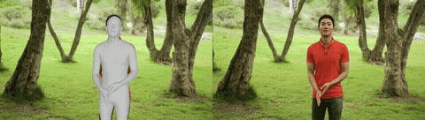

# vid2smplx

**Extract full-body SMPL-X parameters from monocular video: body, hands, face, gaze, and blink in a single pipeline.**

<p align="center">
  
</p>

## Why vid2smplx?

Most video-to-3D methods either recover body pose alone (no hands, no face) or output a single mesh with no way to separately control fingers, jaw, or gaze. [SMPLest-X](https://github.com/sangho-vision/SMPLest-X) is a recent single-model approach that regresses SMPL-X directly, but produces a monolithic mesh without disentangled hand or face articulation.

vid2smplx runs five specialized models in sequence and merges their outputs into a single SMPL-X parameter file with separate, editable channels for body, hands, face, gaze, and blink.

## Pipeline

```
Video --> GVHMR --> HaMeR --> EMICA --> L2CS-Net --> MediaPipe --> Merge --> smplx_params.npz
           body     hands     face      gaze         blink
```

Each step caches its output. Rerunning skips completed steps.

## Output

A single `.npz` per video:

| Parameter | Shape | Source |
|-----------|-------|--------|
| `body_pose` | (T, 63) | GVHMR, 21 body joints in axis-angle |
| `global_orient` | (T, 3) | GVHMR, root orientation |
| `transl` | (T, 3) | GVHMR, global translation |
| `betas` | (T, 10) | GVHMR, body shape |
| `left_hand_pose` | (T, 45) | HaMeR, 15 hand joints in axis-angle |
| `right_hand_pose` | (T, 45) | HaMeR, 15 hand joints in axis-angle |
| `jaw_pose` | (T, 3) | EMICA, jaw rotation |
| `expression` | (T, 10) | EMICA, SMPL-X expression coefficients |
| `flame_expression` | (T, 100) | EMICA, full FLAME expression (100-dim) |
| `leye_pose` / `reye_pose` | (T, 3) | EMICA, eye rotations |
| `gaze_pitch` / `gaze_yaw` | (T,) | L2CS-Net, gaze direction in radians |
| `blink_left` / `blink_right` | (T,) | MediaPipe, Eye Aspect Ratio (low = closed) |
| `left_hand_valid` / `right_hand_valid` | (T,) | per-frame hand detection mask |
| `face_valid` | (T,) | per-frame face detection mask |
| `gaze_valid` | (T,) | per-frame gaze detection mask |
| `K_fullimg` | (T, 3, 3) | GVHMR, camera intrinsic matrix |
| `num_frames` | scalar | total frame count |
| `coord_system` | string | `"global"` (world-space) |

All outputs are at 30 FPS.

## Requirements

- Linux (tested on Ubuntu 20.04/22.04)
- NVIDIA GPU with 16GB+ VRAM (tested on RTX 8000, A100, H100)
- CUDA 12.1
- Conda
- ~15GB disk for model weights

## Installation

```bash
git clone https://github.com/articulab/vid2smplx.git
cd vid2smplx
bash install.sh
```

This will:
1. Create a `vid2smplx` conda environment (Python 3.10, PyTorch 2.3.0+CUDA 12.1)
2. Clone GVHMR and HaMeR repositories
3. Download model weights (~12GB)

After installation, manually download body models that require registration (free):
- **SMPL-X**: https://smpl-x.is.tue.mpg.de/ -> extract to `models/smplx/`
- **MANO**: https://mano.is.tue.mpg.de/ -> extract to `models/mano/`
- **FLAME**: https://flame.is.tue.mpg.de/ -> extract to `models/flame/`

See [models/README.md](models/README.md) for details.

## Usage

### Basic (NPZ output only)
```bash
bash scripts/process_video.sh /path/to/video.mp4
```

### With final incam render (mesh overlaid on video)
```bash
bash scripts/process_video.sh /path/to/video.mp4 --final_incam
```

### Full debug renders (all intermediate MP4s)
```bash
bash scripts/process_video.sh /path/to/video.mp4 --full_debug
```

### Quick test (first 10% of video)
```bash
bash scripts/process_video.sh /path/to/video.mp4 --percent 10
```

### Try with included example clips
Three CC0-licensed clips are included in `examples/`:
```bash
bash scripts/process_video.sh examples/clip_talking.mp4    # portrait, talking + gestures
bash scripts/process_video.sh examples/clip_dancing.mp4    # landscape, full-body dancing
bash scripts/process_video.sh examples/clip_signing.mp4    # sign language
```

### Options
```
--final_incam          Render the final incam video (body+hands+face mesh on video)
--full_debug           Render all debug MP4s (incam, global, hands, face)
--no_face              Skip face tracking (EMICA), gaze, and blink
--no_hands             Skip hand estimation
--percent N            Process first N% of video (for testing)
--downsample N         Take every Nth frame for hands (default: 1)
--cleanup              Delete intermediates, keep only smplx_params.npz + gaze_blink
--output_dir DIR       Custom output directory (default: output/)
--dynamic_cam          Use visual odometry (default: static camera)
--batch_size N         HaMeR batch size (default: 48)
```

### Output structure
```
output/<video_name>/
├── smplx_params.npz              # merged body+hands+face+gaze+blink
├── SUCCESS                       # marker file
├── gvhmr/<video_name>/           # GVHMR intermediates (deleted with --cleanup)
│   ├── hmr4d_results.pt          #   body estimation results
│   └── 0_input_video.mp4         #   preprocessed input video
├── hamer/<video_name>/           # HaMeR intermediates
│   └── mano_params/              #   per-detection hand params
├── emica/<video_name>/           # EMICA intermediates
│   ├── flame_params.npz          #   FLAME face parameters
│   └── _detection_cache.npz      #   face detection bboxes
├── gaze_blink/<video_name>/      # gaze + blink estimates
│   └── gaze_blink.npz
└── render/                       # only with --final_incam or --full_debug
    ├── og/                       #   GVHMR body renders (--full_debug only)
    │   ├── incam_body.mp4
    │   ├── incam_hands.mp4
    │   ├── front.mp4
    │   ├── left.mp4
    │   └── right.mp4
    ├── final/                    #   final renders (with IK + face)
    │   ├── incam.mp4             #     full SMPL-X mesh on video
    │   ├── front.mp4
    │   ├── left.mp4
    │   ├── right.mp4
    │   └── smplx_params_final.npz
    ├── hands_incam.mp4           #   hand-only mesh on video (--full_debug only)
    ├── face_incam.mp4            #   face-only mesh on video (--full_debug only)
    └── intermediates.pt
```

## Loading results in Python

```python
import numpy as np

data = np.load("output/my_video/smplx_params.npz", allow_pickle=True)

# Body
body_pose = data["body_pose"]           # (T, 63) 21 joints, axis-angle
global_orient = data["global_orient"]   # (T, 3)  root orientation
transl = data["transl"]                 # (T, 3)  global translation
betas = data["betas"]                   # (T, 10) body shape

# Hands
left_hand = data["left_hand_pose"]      # (T, 45) 15 joints, axis-angle
right_hand = data["right_hand_pose"]    # (T, 45)

# Face
jaw_pose = data["jaw_pose"]             # (T, 3)   jaw rotation
expression = data["expression"]         # (T, 10)  SMPL-X expression coeffs
flame_expr = data["flame_expression"]   # (T, 100) full FLAME expression
leye_pose = data["leye_pose"]           # (T, 3)   left eye rotation
reye_pose = data["reye_pose"]           # (T, 3)   right eye rotation

# Gaze and blink
gaze = np.stack([data["gaze_pitch"], data["gaze_yaw"]], axis=-1)    # (T, 2) radians
blink = np.stack([data["blink_left"], data["blink_right"]], axis=-1) # (T, 2) EAR

# Camera
K = data["K_fullimg"]                   # (T, 3, 3) intrinsic matrix

# Metadata
num_frames = int(data["num_frames"])
coord_system = str(data["coord_system"]) # "global" or "incam"

# Validity masks (filter frames with missing detections)
valid_left_hand = data["left_hand_valid"]   # (T,) bool
valid_right_hand = data["right_hand_valid"] # (T,) bool
valid_face = data["face_valid"]             # (T,) bool
valid_gaze = data["gaze_valid"]             # (T,) bool
```

## Comparison with SMPLest-X

We compared vid2smplx with [SMPLest-X](https://github.com/sangho-vision/SMPLest-X) on CC0-licensed clips (Quadro RTX 8000, 46GB). SMPLest-X is faster but outputs a single mesh without separate hand or face control. vid2smplx is slower but gives you independent parameters for each body part.

Each GIF shows **vid2smplx | Original | SMPLest-X**.

### Talking (portrait, 1080x1920, 25fps, 14.7s)


> Video by [Antoni Shkraba Studio](https://www.pexels.com/video/a-man-talking-while-looking-at-camera-8048476/) from Pexels

### Dancing (landscape, 1920x1080, 30fps, 19.9s)


> Video by [RDNE Stock project](https://www.pexels.com/video/a-man-dancing-and-cheering-in-the-park-7550572/) from Pexels

### Sign Language (ultra-wide 4K, 4096x2160, 25fps, 19.1s)


> Video by [cottonbro studio](https://www.pexels.com/video/woman-communicating-in-sign-language-6321904/) from Pexels

<details>
<summary><b>Hand articulation detail</b></summary>

vid2smplx recovers individual finger poses via HaMeR (MANO). SMPLest-X produces a single body mesh with fused hands. Each image shows **vid2smplx | Original | SMPLest-X**:


</details>

<details>
<summary><b>Facial expression detail</b></summary>

vid2smplx captures jaw opening and mouth shapes via EMICA/FLAME. SMPLest-X keeps a neutral closed mouth throughout:


</details>

<details>
<summary><b>Timing breakdown</b></summary>

| Step | Talking (369f) | Dancing (598f) | Signing (478f) |
|------|---------------|----------------|----------------|
| GVHMR (body) | 170s | 137s | 202s |
| HaMeR (hands) | 191s | 141s | 637s |
| EMICA (face) | 159s | 192s | 415s |
| L2CS + MediaPipe (gaze/blink) | 73s | 101s | 298s |
| Merge | 7s | 9s | 7s |
| Render (final incam) | 91s | 92s | 208s |
| **vid2smplx total** | **697s** | **~680s** | **1772s** |
| **SMPLest-X total** | **326s** | **486s** | **617s** |

The signing clip shows the largest gap because HaMeR processes many more hand detections per frame.

</details>

## Models and citations

- **[GVHMR](https://github.com/zju3dv/GVHMR)**: World-grounded human motion recovery. Liang et al., SIGGRAPH Asia 2024.
- **[HaMeR](https://github.com/geopavlakos/hamer)**: Hand mesh recovery. Pavlakos et al., CVPR 2024.
- **[EMICA](https://github.com/radekd91/inferno)**: Emotion-driven face reconstruction via FLAME. Danecek et al., CVPR 2022.
- **[L2CS-Net](https://github.com/Ahmednull/L2CS-Net)**: Gaze estimation. Abdelrahman et al., 2023.
- **[SMPL-X](https://smpl-x.is.tue.mpg.de/)**: Expressive body model. Pavlakos et al., CVPR 2019.
- **[MediaPipe](https://developers.google.com/mediapipe)**: Face mesh for blink detection (Eye Aspect Ratio).

## License

MIT. See [LICENSE](LICENSE).

The body models (SMPL-X, MANO, FLAME) have their own licenses from Max Planck Institute and are for research purposes only.

