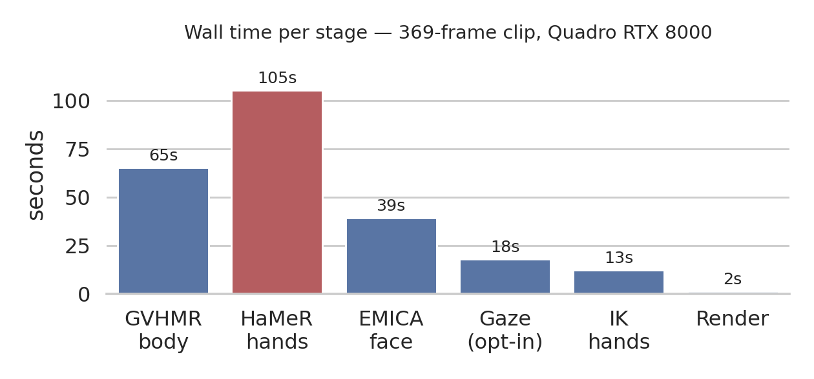

# Benchmarks

Every number is **MEASURED** (card + date) unless labelled INFERRED. Peak VRAM is above the idle
baseline. Raw numbers: [benchmarks.json](benchmarks.json).

## VRAM

**8 GB minimum, ~16 GB for long video.** Peak is set mostly by *the card*, not the clip: EMICA,
HaMeR, ViTPose and the HMR2 feature pass size their batches from **free VRAM**
(`GVHMR/hmr4d/utils/auto_batch.py`), so the same clip expands on a big card and contracts on a small
one. Whole-pipeline peak, `scripts/bench.py examples/clip_talking.mp4`:

| Card | 39 f | 150 f | 369 f |
|---|---:|---:|---:|
| RTX PRO 1000 Laptop, **8 GB** (2026-09, Blackwell env) | — | — | **5.1 GB** |
| Quadro RTX 8000, **46 GB** (2026-09-13, gpu006, GVHMR `ea4ba35`) | 7.3 GB | 8.3 GB | **12.3 GB** |

Clip length enters only through GVHMR's HMR4D pass, and since banded attention (GVHMR `8be5155`) it
is flat: 9.7 GB at 727, 3,587 and 12,526 frames (rtx8000, `ea4ba35`, `--no-hands --no-face`; walls
86 s / 334 s / 1,130 s, all rc=0).

| frames | 727 | 3,587 | 12,526 |
|---|---|---|---|
| GVHMR peak | 9.7 GB | 9.7 GB | 9.7 GB |

Flat: peak does not grow with clip length. Batches size from *free* VRAM, so the peak tracks the
card, not the video — the same 369-frame clip peaks at 5.1 GB on an 8 GB card and 12.3 GB on a 46 GB one.

The 35,755-frame (20 min) point is **pre-`ea4ba35` and has never been re-measured**: 13,710 MiB,
1 h 18 m, rc=0 on a 46 GB card. It is an **upper bound**, not a measurement of what a small card
needs. A 2026-09-13 attempt at 35,024 frames failed before GVHMR reported and its log was lost, so
there is no post-fix 20-minute figure at all. Re-running a 20-min clip is the most useful missing
measurement.

| you have | you can run | basis |
|---|---|---|
| 8 GB | up to 12,526 frames | MEASURED end-to-end to 369 frames (5.1 GB); INFERRED beyond, from the flat 9.7 GB sweep |
| ~16 GB | any length that fits in wall time | INFERRED — 13.7 GB is the whole stage; no 16 GB run of a 20-min video exists |
| 45 GB+ (rtx8000, a100, h100) | any length | MEASURED to 35,755 frames (pre-`ea4ba35`) |

`vid2smplx run` preflights this (`checks.py: vram_warning`) and warns — never refuses — only past
12,526 frames on a card under ~16 GB. It does not estimate your peak from frame count: peak follows
the card, so that number would be fiction.

## Stage timings

HaMeR is 43% of the run and the obvious target for any speedup work.

MEASURED 2026-09-13, gpu006, GVHMR `ea4ba35`, ViTPose fp16 OFF (the default):

| Stage | 39 f | 150 f | 369 f | Peak @369 | GPU util |
|-------|-----:|------:|------:|----------:|---------:|
| GVHMR (body) | 32.7 s | 41.7 s | 65.3 s | 10.0 GB | 10–32 % |
| HaMeR (hands) | 45.9 s | 64.2 s | 105.3 s | 8.3 GB | 6–19 % |
| EMICA (face) | 18.3 s | 25.3 s | 39.4 s | **12.3 GB** | 4–13 % |
| L2CS + MediaPipe (`--gaze` only) | 10.1 s | 12.3 s | 18.1 s | 3.7 GB | 1–14 % |
| IK hands | 10.1 s | 9.2 s | 12.6 s | 1.3 GB | 10–48 % |
| Render (`--final-incam`) | 1.3 s | 1.4 s | 1.6 s | — | 0–3 % |
| **Total** | **123 s** | **159 s** | **246 s** | **12.3 GB** | |

RTX PRO 1000 Laptop (8 GB, Blackwell, env `vid2smplx_bw`), MEASURED 2026-09 **before** banded
attention and free-VRAM batches — the only 8 GB datapoint, historical:

| Stage | 39 f | 150 f | 369 f | Peak |
|-------|-----:|------:|------:|-----:|
| GVHMR | 44 s | 71 s | 123 s | 4.5 GB |
| HaMeR | 63 s | 96 s | 167 s | 5.1 GB |
| EMICA | 28 s | 30 s | 59 s | 4.8 GB |
| L2CS + MediaPipe | 6 s | 11 s | 18 s | 3.6 GB |
| Merge / IK | 2 s / 11 s | 2 s / 19 s | 2 s / 36 s | 1.1 GB |
| **Total** | **157 s** | **230 s** | **408 s** | **5.1 GB** |

Budget **~1 s per frame on an 8 GB laptop, ~0.67 s on an rtx8000**; wall time scales linearly. Whole
clips end to end (with renders) are in [comparison.md](comparison.md).

- **The GPU is mostly idle** (util 1–48 %): time goes to video decoding, face/hand cropping and
  loading five models. A bigger `--batch-size` will not help; more CPU cores or a faster disk will.
  `run` prints `[GPU] peak … util …%` per stage and flags anything below 40 %.
- **Splitting a video** costs ~100 s of model reloads per chunk plus a seam in GVHMR's global
  trajectory, so the pipeline does not do it — and since banded attention it does not need to.
- **Output is small**: 4.4 MB for 39 frames, 16 MB for 150 frames with renders, 46 MB for a 20-min
  clip after `--cleanup`.

## GVHMR VRAM was quadratic — fixed in GVHMR 8be5155

HMR4D runs over the whole sequence and expressed its 120-frame attention window as a dense (L, L)
mask, so `RoPEAttention` materialised a `(B, heads, L, L)` fp32 score tensor: 35,755² × 8 × 4 B =
**38.10 GiB**, matching the OOM message exactly, with several live at once (≈76 GiB). Only an 80 GB
card ever finished a 20-min video. The mask itself was never the cost (bool, 1.19 GiB, and `expand`
makes it a view).

The window is now per-query `[lo, hi)` bounds and attention runs blockwise through
`scaled_dot_product_attention`; the score matrix is never built. Standalone at GVHMR's shapes,
rtx8000: **16,000 frames 15.60 → 0.81 GiB**, **35,755 frames OOM at 38.10 → 3.78 GiB**.

Same operator, not an approximation, but it reassociates float sums. Same GPU, same cached features,
L = 12,000 — dense vs banded, max abs:

| quantity | max abs | rms |
|---|---:|---:|
| `smpl_params_incam` `global_orient`, `transl` | 7.2e-7 | 1.0e-7 |
| `betas` | 1.2e-7 | 4.2e-8 |
| `body_pose` | 1.4e-3 | 4.6e-5 |
| `smpl_params_global` `global_orient` | 6.1 rad | 0.55 |

The last row is not the mask: world-frame orientation is a sequential product of per-frame rotations
over the whole clip (`gvhmr_pipeline.py`), so any perturbation compounds (median 3.6e-7 over the
first 10 % of frames, 2.3e-3 over 75 %, while in-camera stays at 9e-8). Cross-machine drift moves the
same quantity by 6.16 rad, so **world-frame `global_orient` on a long clip was never reproducible**
either way. Use `*_incam` when you need a reproducible orientation.

Rejected alternatives: **FlexAttention** needs torch ≥ 2.5 (pinned to 2.3.0 here — verified
`ModuleNotFoundError` on the cluster); **chunking with overlap** cannot be interior-exact (the
receptive field is ±60 frames *per layer* over 12 layers — measured ±720 after 12 — and `avgbeta`
averages `betas` over the entire sequence); **a boolean mask** is what it already was.

## Throughput fixes (2026-09-13)

| fix | effect |
|---|---|
| SLURM array `%1` → `%5`, `--time` 24 h → 6 h | `%1` paid 96 sequential queue waits (rtx8000 median 29 min / p90 15 h; h100 median 34 min / p90 36 h, over 11,706 jobs). QOS `normal` caps 8 concurrent GPUs; a 24 h reservation cannot be backfilled and the median clip is 1.4 h |
| Auto batch size reads **free** VRAM, not total (`auto_batch.py`) | three concurrent pipelines each claimed the whole card: 827 s → >1500 s, **3.4x slower per clip**. `free <= total` always, so it cannot OOM where the old form fit |
| fp16 autocast on GVHMR's ViTPose | **3.66x** (754.2 → 206.3 ms/batch-32, rtx8000 sm_7.5), heatmap `max\|d\|` 1.9e-4. Never bf16: 0.67x on sm_7.5. `VID2SMPLX_VITPOSE_FP16=0` restores fp32 |
| `seed_everything` no longer sets cudnn flags | they are backend performance flags, not RNG state, and every `--seed` run paid: EMICA **666 → 1822 ms, 2.74x slower** |
