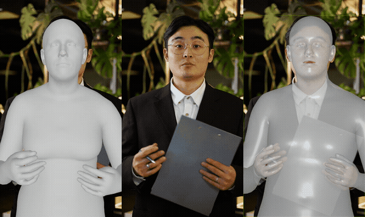
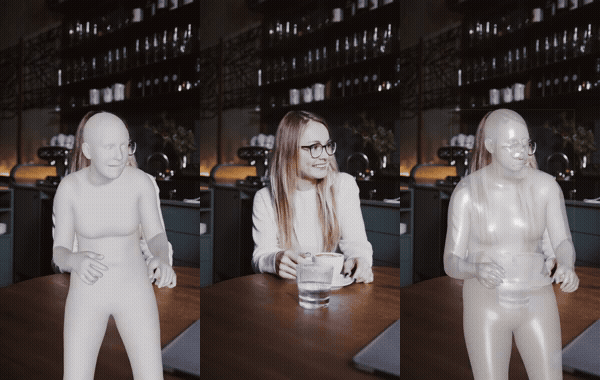
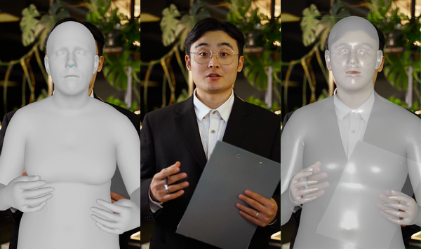
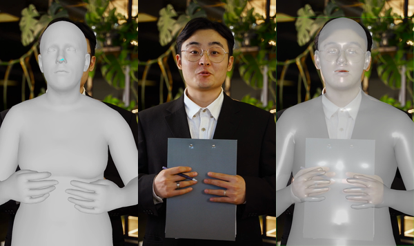
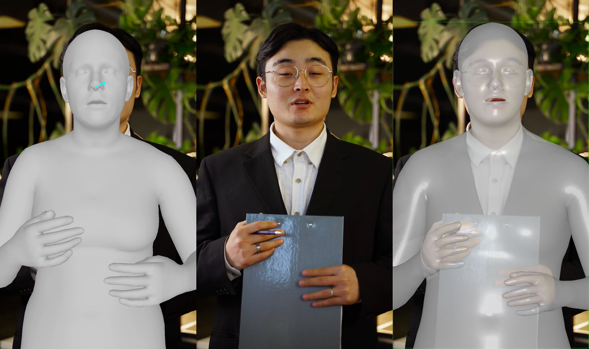
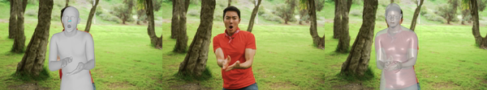
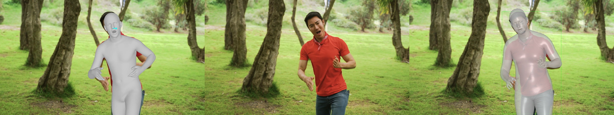

# Comparison with SMPLest-X

We compared vid2smplx with [SMPLest-X](https://github.com/sangho-vision/SMPLest-X) on CC0-licensed clips (Quadro RTX 8000, 46GB). SMPLest-X is faster but outputs a single mesh without separate hand or face control. vid2smplx is slower but gives you independent parameters for each body part.

Each GIF shows **vid2smplx | Original | SMPLest-X**.

### Talking (portrait, 1080x1920, 25fps, 14.7s)

> Video by [Antoni Shkraba Studio](https://www.pexels.com/video/a-man-talking-while-looking-at-camera-8048476/) from Pexels

### Dancing (landscape, 1920x1080, 30fps, 19.9s)

> Video by [RDNE Stock project](https://www.pexels.com/video/a-man-dancing-and-cheering-in-the-park-7550572/) from Pexels

### Sign Language (ultra-wide 4K, 4096x2160, 25fps, 19.1s)

> Video by [cottonbro studio](https://www.pexels.com/video/woman-communicating-in-sign-language-6321904/) from Pexels

<b>Hand articulation detail</b>

vid2smplx recovers individual finger poses via HaMeR (MANO). SMPLest-X produces a single body mesh with fused hands. Each image shows **vid2smplx | Original | SMPLest-X**:

<b>Facial expression detail</b>

vid2smplx captures jaw opening and mouth shapes via EMICA/FLAME. SMPLest-X keeps a neutral closed mouth throughout:

<b>Timing breakdown</b>

| Step | Talking (369f) | Dancing (598f) | Signing (478f) |
|------|---------------|----------------|----------------|
| GVHMR (body) | 170s | 137s | 202s |
| HaMeR (hands) | 191s | 141s | 637s |
| EMICA (face) | 159s | 192s | 415s |
| L2CS + MediaPipe (gaze/blink) | 73s | 101s | 298s |
| Merge | 7s | 9s | 7s |
| Render (final incam) | 91s | 92s | 208s |
| **vid2smplx total** | **697s** | **~680s** | **1772s** |
| **SMPLest-X total** | **326s** | **486s** | **617s** |

The signing clip shows the largest gap because HaMeR processes many more hand detections per frame.

